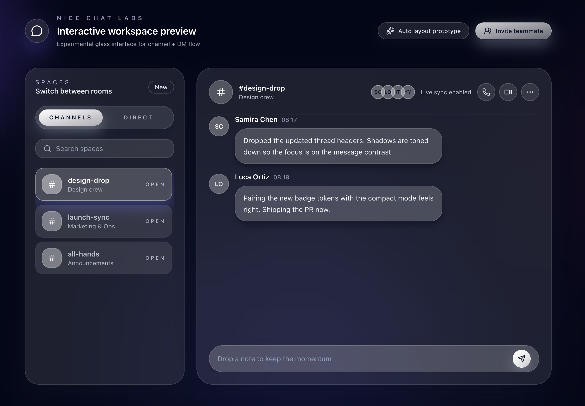

# Nice Chat

A responsive mock chat workspace demo with channels and DMs.

## Technologies Used
- React 19 + Vite
- TanStack Router (file-based routes)
- Tailwind CSS 4
- Lucide React (icons)

## How to Run
1. Clone this repository
2. Install dependencies: `pnpm install`
3. Start the dev server: `pnpm dev` (or `pnpm start`)
4. Open `http://localhost:3000`

## Features
- Responsive glass UI tuned for mobile and desktop
- Channels and Direct Messages with seeded mock threads
- Interactive composer that appends messages locally
- Simple routes: landing `/` and interactive demo `/demo`
- Clean, modern color palette with accessible iconography

