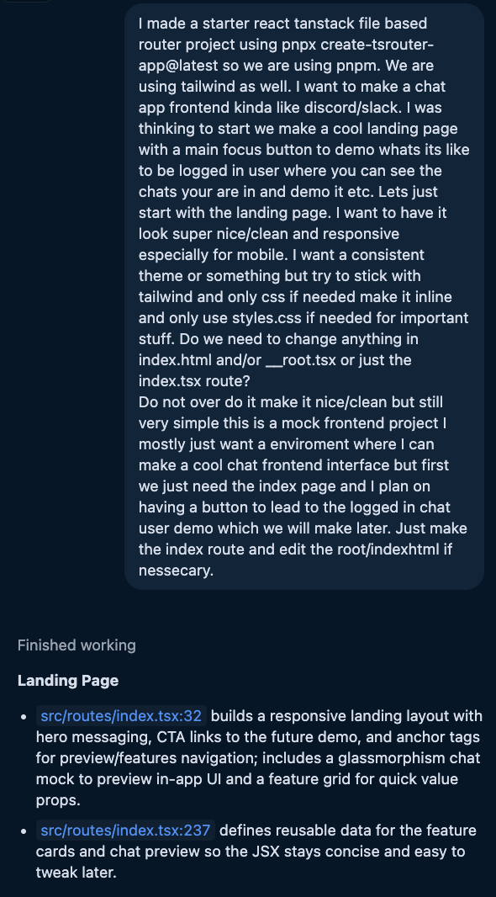

## 1. What did you ask Copilot to help you build? How did you break down the problem?
I started by explaining the context of the project like the website base I have setup. If this was a bigger project I would have it come up with a plan or outline to break down each part but instead I broke it down myself and started by asking for the landing page. Then I got started on the chat demo page. However on my first attempt the AI was doing too much at once so I had to break it down further.

## 2. How did your approach to asking questions change as you worked?
I realized I don't have to focus as much on making sure I'm asking the perfect question. I can just ask a simple question and if the result isn't what I want I can just refine it or ask a follow up question. I also learned that if I want something specific I need to be very clear about it in my prompt.

## 3. What parts of the development process with GitHub Copilot surprised you?
I was mostly surprised by how smart the AI is getting with understanding the context as well as the agent mode being able to do multiple steps at once. The AI also does a good job at explaining the changes it makes.

## 4. What did you learn about the technology you used that you didn't know before?
I have used React + Tanstack Router before but I have never deployed it on github pages. I was able to get the AI to help me set it up including the workflow and even explain how it works so I can do it again in future projects.

## 5. What would you do differently if you had to build this again?
I would do more planning with or without AI so I could come up with a better initial prompt. By being too ventral I had to do a lot of follow up prompts for the same part that I'm trying to make. I also wouldn't use the agent mode because it does too much at once and I don't have as much control over the output.